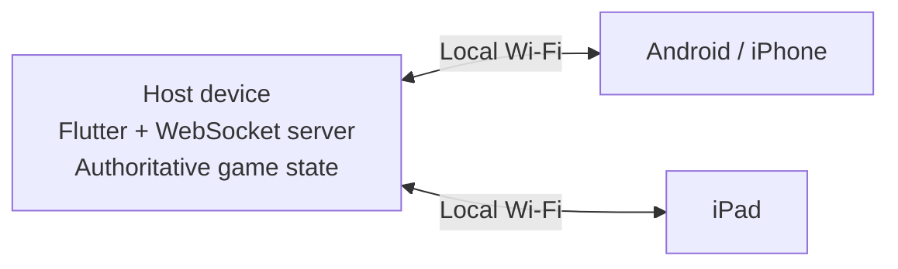
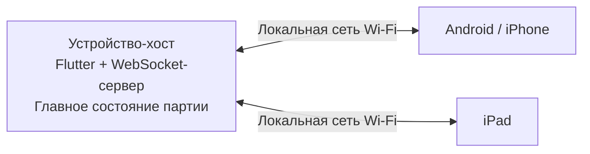

# 🎲 Tabletop Companion

> Less bookkeeping. More adventure.

A cross-platform companion app for tabletop card games with Munchkin-style mechanics. It keeps every player in sync while the cards, negotiations, and chaos stay where they belong—on the table.

[English](#english) · [Русский](#русский)

> **Project status:** a functional local-first MVP is implemented. The current development targets Android and iOS/iPadOS; real-device and mixed-network validation is the next milestone.

---

## English

### What is it?

Tabletop Companion handles the routine parts of a physical game without trying to replace it. The app tracks player stats, turn order, battles, shared timers, and dice rolls across phones, tablets, and computers.

Physical cards, monster strength, modifiers, rewards, and table agreements remain in the hands of the players.

### Core features

- Create a room on one device and join from others via QR code.
- Play locally over Wi-Fi without accounts, cloud services, or internet access.
- Track each player's level, strength, and total power.
- Keep a synchronized turn order and clearly show the active player.
- Guide battles through victory, intervention, help, and escape flows.
- Run one authoritative countdown before a battle victory is confirmed.
- Roll a synchronized virtual D6 or use a physical die.
- Restore the current game state after a temporary disconnect.
- Target Android and iOS/iPadOS from one Flutter codebase.

### Local-first architecture

One device creates the room and becomes the authoritative host. It validates every command, owns the game state, resolves timers and dice rolls, and broadcasts updates to all connected players.

The game logic is separated from the transport layer. A common connection interface will allow a future online backend to be added without rebuilding the core UI and rules.

### Technology

| Area | Choice |
| --- | --- |
| UI and platforms | Flutter / Dart |
| State management | Riverpod |
| Navigation | `go_router` |
| Local networking | `dart:io`, `HttpServer`, WebSocket |
| Protocol | Versioned JSON messages |
| Room sharing | QR code and scanner |
| Models | Freezed + JSON serialization |
| Local storage | Shared preferences, secure storage, game snapshots |

### Roadmap

- [x] Flutter project foundation, Material 3 UI, navigation, Riverpod, and EN/RU localization
- [x] Game domain models, commands, permissions, validation, and state machine
- [x] Authoritative local host and client connections over WebSocket
- [x] Room creation, QR/manual joining, settings, and player lobby
- [x] Turn order, player stats, active-player controls, and synchronized turns
- [x] Battle flow, shared timer, intervention, help, escape, and guarded level rewards
- [x] Virtual/physical dice, host-reviewed dice appeals, reconnection, and snapshot recovery
- [ ] Testing on real devices and mixed-platform local networks
- [ ] MVP stabilization: permission failures, host backgrounding, IP changes, and hotspot scenarios
- [ ] Optional post-MVP online rooms and persistent player profiles

### Product principle

The app should stay quick and unobtrusive. It provides one trustworthy view of the game, but never asks players to record every card, monster, or table decision.

---

## Русский

### Что это?

Tabletop Companion — кроссплатформенный помощник для настольных карточных игр с механиками в духе «Манчкина». Он берёт на себя рутинные действия, не пытаясь заменить физическую игру: синхронизирует показатели участников, очерёдность ходов, бои, общие таймеры и броски кубика.

Карты, сила монстров, модификаторы, награды и договорённости по-прежнему остаются за игровым столом.

### Основные возможности

- Создание комнаты на одном устройстве и подключение остальных по QR-коду.
- Локальная игра по Wi-Fi без аккаунтов, облачного сервера и интернета.
- Учёт уровня, силы и общей мощи каждого участника.
- Синхронная очерёдность ходов и наглядное отображение активного игрока.
- Сопровождение боя: победа, вмешательство, запрос помощи и побег.
- Единый достоверный таймер перед подтверждением победы.
- Синхронный виртуальный D6 или напоминание о физическом кубике.
- Восстановление состояния партии после краткого отключения.
- Поддержка Android и iOS/iPadOS из общей кодовой базы Flutter.

### Локальная архитектура

Одно устройство создаёт комнату и становится главным хостом. Оно проверяет все команды, хранит состояние партии, управляет таймерами и бросками кубика, а затем рассылает подтверждённые изменения подключённым игрокам.

Игровая логика отделена от сетевого транспорта. Благодаря общему интерфейсу подключения онлайн-бэкенд можно будет добавить позже, не переписывая основные экраны и правила.

### Технологии

| Область | Решение |
| --- | --- |
| Интерфейс и платформы | Flutter / Dart |
| Управление состоянием | Riverpod |
| Навигация | `go_router` |
| Локальная сеть | `dart:io`, `HttpServer`, WebSocket |
| Протокол | Версионированные JSON-сообщения |
| Подключение к комнате | QR-код и сканер |
| Модели | Freezed + JSON-сериализация |
| Локальное хранение | Настройки, защищённое хранилище и снимки партии |

### План разработки

- [x] Основа Flutter-проекта, Material 3, навигация, Riverpod и локализация EN/RU
- [x] Доменные модели, команды, права, проверки и машина состояний
- [x] Авторитетный локальный хост и подключения клиентов по WebSocket
- [x] Создание комнаты, вход по QR-коду/вручную, настройки и лобби игроков
- [x] Очерёдность, показатели, права активного игрока и синхронная передача хода
- [x] Бой, общий таймер, вмешательство, помощь, побег и защищённая выдача уровней
- [x] Виртуальный/физический кубик, апелляции ведущему, переподключение и восстановление партии
- [ ] Тестирование на реальных устройствах и смешанных локальных сетях
- [ ] Стабилизация MVP: отказы разрешений, фон хоста, смена IP и работа через hotspot
- [ ] Онлайн-комнаты и постоянные профили игроков после MVP

### Принцип продукта

Приложение должно оставаться быстрым и ненавязчивым. Оно создаёт единое достоверное состояние партии, но не заставляет участников вводить каждую карту, каждого монстра и каждое решение за столом.

---

> This is an independent companion project and is not affiliated with or endorsed by the owners of the Munchkin trademark.
